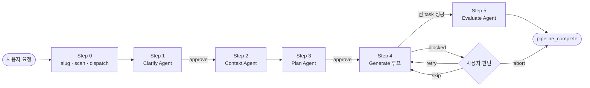
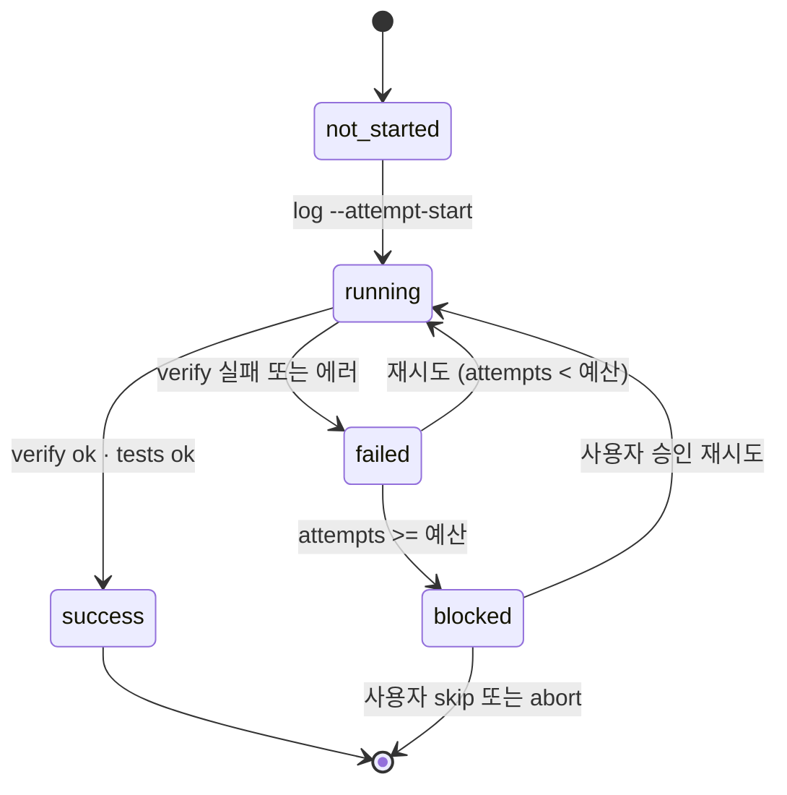

<div align="center">

# harness

**Claude Code를 위한 적응적 5단계 기능 구현 파이프라인.**

Clarify → Context → Plan → Generate → Evaluate.
결정적 상태, 크래시 세이프 재개, 창의 작업과 장부 관리 사이의 하드 경계.

[English](./README.md) · **한국어** · [简体中文](./README.zh.md)

[](https://www.python.org/)
[](https://claude.com/claude-code)
[](./scripts/tests/)
[](./scripts/harness.py)

</div>

---

## 무엇을 하는가

스킬 한 번 호출, 의도에서 리뷰된 코드까지 다섯 단계 여정:

```
/harness Flask 앱에 /version 엔드포인트 추가
```

- Claude가 요청을 분석하고 논의점을 사용자에게 확인받음
- 프로젝트 컨벤션에 자기를 정렬하기 위해 코드베이스를 훑음
- Phase/Task YAML 계획을 작성해 승인을 요청
- 각 task를 전용 서브 에이전트로 실행하며 구조화된 상태를 유지
- 프로젝트에서 발견한 type / lint / test 도구를 돌리고 판정을 낸다

어느 단계에서 크래시해도, 재시작한 세션은 `harness scan <slug>`를 호출해 **정확히 다음 실행 가능한 task에서 재개한다** — 재명확화 없이, 재계획 없이, 성공한 작업을 다시 돌리지 않고.

## 왜 하이브리드 스킬인가

대부분의 Claude Code 워크플로는 순수 자연어로 돌아가며, 두 종류의 작업을 섞어 놓는다:

- **창의적 작업.** 계획 설계, 코드 작성, 낯선 실패 진단, 사용자 대화.
- **장부 관리.** 어느 task가 돌았는지? 선언한 파일을 정말로 만들었는지? 계획 해시가 task 로그와 여전히 일치하는지? 다음에 뭐가 돌지?

두 번째 종류를 자연어로 하는 건 비싸고(Claude가 턴마다 상태를 재계산), 흔들리고(같은 질문에 세션마다 다른 답), 부서지기 쉽다(실패한 task가 재개 시 완료로 잘못 표시될 수 있음).

`harness`는 둘을 단단한 계약으로 쪼갠다:

| 레인 | 담당 | 책임 |
|---|---|---|
| 창의 | Claude (Skill + Agent) | Clarify · Context · Plan · Task 구현 · Evaluate · 사용자 대화 · 실패 추론 |
| 결정적 | `scripts/harness.py` | slug 정규화 · 상태 스캔 · 재개 지점 계산 · 사이드카 쓰기 · 산출물 검증 · 충돌 감지 · summary 집계 · 게이트 승인 · 계획 아카이브 |

CLI는 절대 LLM을 호출하지 않는다. 스킬은 절대 사이드카를 건드리지 않는다.

## 빠른 시작

Claude Code 세션 안에서 설치:

```
/plugin marketplace add skarl86/harness
/plugin install harness@claude-harness
```

> `skarl86/harness`는 마켓플레이스가 있는 GitHub 슬러그. `claude-harness`는 `.claude-plugin/marketplace.json`에 선언된 마켓플레이스 이름. 플러그인 자체는 `harness`.

런타임 사전 요건 (1회):

```bash
pip install pyyaml
```

그다음 스킬 호출:

```
/harness <기능 요청>
```

산출물은 프로젝트의 `.harness/{slug}/` 밑에 쓰이므로, 여러 동시 요청이 서로를 덮어쓰지 않는다.

> **개발용 설치** (마켓플레이스 대신 클론 — `harness` 자체를 해킹할 때 유용):
> ```bash
> git clone https://github.com/skarl86/harness.git ~/.claude/plugins/harness
> pip install pyyaml
> ```

## 아키텍처



Step 4 내부에서, 각 task는 CLI가 주관하는 작은 상태 머신을 따른다:



## 특징

- **재개 우선.** `scan`이 파일 존재 여부 휴리스틱이 아니라 구조화된 task 사이드카와 계획 체크섬으로부터 상태를 도출. 어디서 크래시해도 재시작해 계속 진행.
- **적응적 실패 분류.** `classify-failure`가 A(자동 재시도) / B(사용자 판단) / C(에스컬레이션)을 reasons[] 목록과 함께 반환 — 최종 결정은 Claude가.
- **병렬 안전.** `depends_on`이 없는 task들은 한 메시지에서 함께 돌릴 수 있음. `conflicts`가 `artifacts.outputs` 중복 선언을 충돌 전에 포착.
- **Stale 감지.** 각 task 사이드카는 실행 시점 계획 체크섬을 보관. `stale`이 in-place 계획 편집 후 드리프트를 표면화.
- **언어 인식 verify.** `verify --syntax`가 확장자별로 stdlib 파서(`py_compile`, `json.load`, `yaml.safe_load`)를 항상 켜진 구조 검증 위에 실행.
- **게이트 강제.** Clarify와 Plan 단계는 `approve --step N`이 있어야 진행. 자연어만으로 넘어가지 않는다.
- **영속 config.** `harness config --max-attempts N`이 env-var 체조 없이 셸을 넘어 살아남는다.
- **스키마 버전 고정 상태.** 영속화된 모든 JSON이 `schema_version: 1`. 알 수 없는 버전은 하드 거부.
- **원자적 쓰기.** 상태 파일은 `tempfile + os.replace`. 쓰기 중 크래시는 이전 파일 또는 없음만 남기지, 중간 상태는 절대 없다.

## 명령어

전체 레퍼런스: [`scripts/README.md`](./scripts/README.md). 모든 명령은 exit=0일 때 stdout에 JSON을, 그 외엔 stderr에 사람이 읽을 진단을 낸다.

| 명령 | 용도 |
|---|---|
| `slug` | 슬러그 정규화, `.harness/{slug}/` 생성, `00-request.md` 쓰기 |
| `scan` | 전체 파이프라인 상태 계산 (steps, phases, resume point, orphans, stale) |
| `next` | 다음 실행 가능한 task를 전체 계획 정의와 함께 반환 |
| `log` | task 상태 사이드카를 원자적으로 생성 또는 갱신 |
| `verify` | 선언된 output 존재 확인 (선택적으로 `--syntax` 검사) |
| `conflicts` | 병렬 실행 전에 task 간 output 중복 감지 |
| `summary` | task 상태를 `04-generate/summary.md`로 집계 |
| `approve` | step 1 (Clarify) 또는 step 3 (Plan)의 사용자 게이트 승인 기록 |
| `archive-plan` | 재계획 시 현재 `03-plan/`을 `03-plan.v{N}/`으로 이동 |
| `classify-failure` | 휴리스틱 실패 분류 (A/B/C)와 reasons |
| `stale` | 계획 체크섬 및 승인 artifact 드리프트 노출 |
| `cleanup` | 슬러그의 artifact 트리를 백업(기본) 또는 삭제(`--purge`) |
| `list` | `.harness/` 아래 모든 슬러그 열거 |
| `config` | 슬러그별 `config.json` 조회 또는 갱신 (예: `--max-attempts N`) |

세션 예시:

```bash
$ harness scan add-login-feature | jq .resume_point
{
  "task_id": "2.2",
  "phase": 2,
  "reason": "failed_within_budget"
}

$ harness classify-failure add-login-feature 2.2 | jq '{suggested_class, confidence, reasons}'
{
  "suggested_class": "A",
  "confidence": "high",
  "reasons": [
    "1/2 outputs with issues: src/auth/login.ts (empty)"
  ]
}
```

## Artifact 레이아웃

```
.harness/{slug}/
├── 00-request.md                사용자의 원본 요청
├── 01-clarify.md                Clarify Agent 출력 + 사용자 피드백
├── 02-context.md                Context Agent 출력 (코드베이스 컨벤션)
├── 03-plan/
│   ├── phase-1-*.yaml
│   └── phase-2-*.yaml
├── 03-plan.v1/                  아카이브된 이전 계획 (있으면)
├── 04-generate/
│   ├── task-1.1.md              사람용 리포트 (자유 형식)
│   ├── task-1.1.json            기계 상태 사이드카 (스키마 버전 고정)
│   ├── task-1.2.md / .json
│   └── summary.md               집계 리포트
├── 05-evaluate.md               품질 판정
├── .approvals/
│   ├── step-1.json
│   └── step-3.json
└── config.json                  슬러그별 override (선택)
```

스키마는 [`scripts/schemas/`](./scripts/schemas/)에 있다:

- [`task-state.schema.json`](./scripts/schemas/task-state.schema.json) — task별 사이드카
- [`plan.schema.json`](./scripts/schemas/plan.schema.json) — phase YAML
- [`approval.schema.json`](./scripts/schemas/approval.schema.json) — 게이트 승인
- [`config.schema.json`](./scripts/schemas/config.schema.json) — 슬러그별 config

## 개발

```bash
git clone https://github.com/skarl86/harness.git
cd harness
pip install pyyaml jsonschema   # jsonschema는 테스트 전용

python3 -m unittest scripts.tests.test_harness
# Ran 79 tests in 0.4s — OK
```

저장소 레이아웃:

```
harness/
├── .claude-plugin/
│   └── plugin.json              플러그인 매니페스트
├── skills/harness/
│   └── SKILL.md                 Claude가 따르는 워크플로
├── scripts/
│   ├── harness.py               CLI (stdlib + PyYAML)
│   ├── README.md                CLI 계약 레퍼런스
│   ├── schemas/                 JSON Schema
│   └── tests/                   유닛 테스트 + 픽스처
└── dogfood/
    ├── run-1-urldecode/         새 프로젝트, 시뮬레이션 실패
    └── run-2-notes-search/      비어있지 않은 코드베이스, 병렬 충돌
```

## Dogfood

실제 두 번의 파이프라인 실행이 스킬이 무엇을 산출하는지에 대한 증거로 커밋되어 있다. 각 디렉터리에는:

- 생성된 코드 (`urldecode.py`, `notes.py`, 테스트)
- 전체 `.harness/{slug}/` artifact 트리
- 관찰된 마찰과 적용된 패치를 기록한 `FINDINGS.md`

| 런 | 시나리오 | 드러난 마찰 |
|---|---|---|
| [run-1-urldecode](./dogfood/run-1-urldecode/) | 빈 프로젝트, 새 파이프라인, 재시도 있는 시뮬레이션 SyntaxError | F1 env-var 영속성; F2 verify 범위 |
| [run-2-notes-search](./dogfood/run-2-notes-search/) | 기존 `notes.py` + 테스트, 병렬 충돌, 회귀 테스트 | F5 회귀 테스트 가이드; F6 동일 파일 충돌 보수성 |

패치 가능한 네 가지 마찰은 모두 in-tree로 수정됐다.

## 릴리스 프로세스

버전은 [Conventional Commits](https://www.conventionalcommits.org/)로 구동되는 [release-please](https://github.com/googleapis/release-please)가 관리한다.

- 기여자 PR은 커밋 prefix를 사용: `feat:`, `fix:`, `chore:`, `docs:`, `refactor:`, `test:`, `perf:`, `ci:`. 본문의 `BREAKING CHANGE:`는 major 범프를 유발.
- `feat:` 또는 `fix:` 커밋을 담은 PR을 `main`으로 머지하면 release-please가 **release PR**을 열거나 업데이트. release PR은 `plugin.json`의 `version`을 올리고 `CHANGELOG.md`를 다시 쓴다.
- release PR을 머지하면 `vX.Y.Z` 태그와 자동 생성 노트를 담은 GitHub Release가 만들어진다.
- 태그 푸시 시, 두 번째 워크플로가 `marketplace.json`의 플러그인 `source`를 릴리스된 커밋 sha로 고정 재작성. 이 시점 이후 `/plugin update harness`를 실행한 사용자는 당시 `main`에 있던 무엇이 아니라 정확히 릴리스된 artifact를 받는다.

`ci.yml`은 매 PR과 `main` 푸시마다 전체 유닛 테스트 매트릭스 (Python 3.9–3.12), JSON Schema 적합성, 매니페스트 건전성, 엔드투엔드 CLI 스모크를 돌린다.

## 상태

초기 단계지만 사용 가능. CLI 표면은 완성 (13/13 서브커맨드), dogfood 런 세 번이 `pipeline_complete`에 도달, 상태 관리 계층에 알려진 정확성 버그 없음.

알려진 후속 작업은 [GitHub Issues](https://github.com/skarl86/harness/issues)에서 추적한다.

## 감사

[Claude Code](https://claude.com/claude-code)를 위해 만들어졌다. 플러그인 레이아웃 관례 (`.claude-plugin/plugin.json`, `${CLAUDE_PLUGIN_ROOT}` 치환)는 Claude Code 플러그인 마켓플레이스의 패턴을 따랐다.
