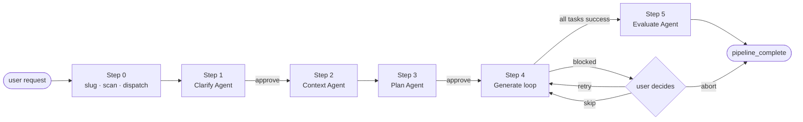
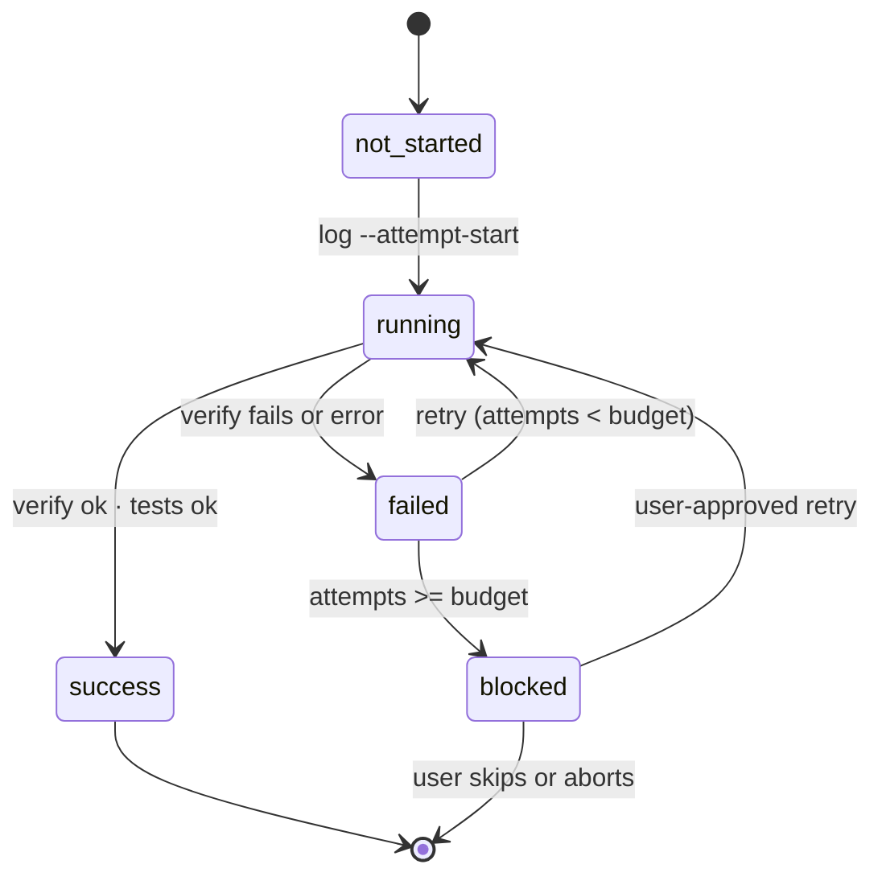

<div align="center">

# harness

**Adaptive 5-phase feature-implementation pipeline for Claude Code.**

Clarify → Context → Plan → Generate → Evaluate.
Deterministic state, crash-safe resume, hard boundary between creative work and bookkeeping.

[](https://www.python.org/)
[](https://claude.com/claude-code)
[](./scripts/tests/)
[](./scripts/harness.py)

</div>

---

## What it does

One skill invocation, a five-phase ride from intent to reviewed code:

```
/harness Add a /version endpoint to the Flask app
```

- Claude analyzes the request, asks you to confirm the discussion points
- Walks the codebase to ground itself in your conventions
- Writes a Phase/Task YAML plan, asks you to sign off
- Executes each task through dedicated sub-agents with structured state
- Runs type/lint/test tools it finds, emits a verdict

If any step crashes, a restarted session calls `harness scan <slug>` and resumes on exactly the next runnable task — no re-clarifying, no re-planning, no re-running work that already succeeded.

## Why a hybrid skill

Most Claude Code workflows live purely in prose, which mixes two very different kinds of work:

- **Creative.** Designing a plan, writing code, diagnosing novel failures, talking to the user.
- **Bookkeeping.** Which task ran? Did it actually produce the files it claimed? Is the plan hash still consistent with the task logs? What runs next?

Doing the second kind in prose is expensive (Claude re-derives state every turn), drifty (same question → different answer across sessions), and fragile (a failed task can be mistakenly marked complete on resume).

`harness` splits the two lanes with a hard contract:

| lane | who | what |
|---|---|---|
| creative | Claude (Skill + Agent) | Clarify · Context · Plan · Task implementation · Evaluate · user dialogue · failure reasoning |
| deterministic | `scripts/harness.py` | slug canonicalization · state scan · resume-point math · sidecar writes · output verification · conflict detection · summary roll-up · gate approvals · plan archival |

The CLI never calls an LLM. The skill never touches sidecars.

## Quickstart

Install as a Claude Code plugin:

```bash
git clone https://github.com/skarl86/harness.git ~/.claude/plugins/harness
pip install pyyaml   # only runtime dependency
```

Then in Claude Code:

```
/harness <your feature request>
```

That's it. All artifacts land under `.harness/{slug}/` in your project, so multiple concurrent requests don't step on each other.

## Architecture



Inside Step 4, each task follows a small state machine driven by the CLI:



## Features

- **Resume-first.** `scan` derives state from structured task sidecars plus plan checksums, not from file-existence heuristics. Crash anywhere, restart, keep going.
- **Adaptive failure classification.** `classify-failure` returns class A (auto-retry), B (user judgment), or C (escalate) with a reasons[] list — Claude makes the final call.
- **Parallel-safe.** Tasks with no `depends_on` can run in the same message; `conflicts` catches overlapping `artifacts.outputs` declarations before they clash.
- **Stale-aware.** Each task sidecar carries the plan-at-execution-time checksum; `stale` surfaces drift after in-place plan edits.
- **Language-aware verify.** `verify --syntax` runs stdlib parsers per extension (`py_compile`, `json.load`, `yaml.safe_load`) on top of the always-on structural check.
- **Gate-enforced.** Clarify and Plan phases require `approve --step N` to advance. No prose-only handshakes.
- **Persistent config.** `harness config --max-attempts N` survives across shells without env-var gymnastics.
- **Schema-versioned state.** Every persisted JSON carries `schema_version: 1`. Unknown versions are rejected hard.
- **Atomic writes.** State files use `tempfile + os.replace`. A crash mid-write leaves either the old file or no file, never a partial one.

## Commands

Full reference: [`scripts/README.md`](./scripts/README.md). All commands emit JSON on stdout when exit=0 and human-readable diagnostics on stderr otherwise.

| Command | Purpose |
|---|---|
| `slug` | Canonicalize a slug, create `.harness/{slug}/`, write `00-request.md` |
| `scan` | Compute full pipeline state (steps, phases, resume point, orphans, stale) |
| `next` | Return the next runnable task with its full plan definition |
| `log` | Create or update a task state sidecar atomically |
| `verify` | Check declared outputs exist (and optionally `--syntax`-check them) |
| `conflicts` | Detect output overlap across tasks before parallel execution |
| `summary` | Aggregate task states into `04-generate/summary.md` |
| `approve` | Record user gate approval for step 1 (Clarify) or step 3 (Plan) |
| `archive-plan` | Move current `03-plan/` to `03-plan.v{N}/` on re-plan |
| `classify-failure` | Heuristic failure class (A/B/C) with reasons |
| `stale` | Surface plan-checksum and approval-artifact drift |
| `cleanup` | Back up (default) or purge (`--purge`) a slug's artifact tree |
| `list` | Enumerate all slugs under `.harness/` |
| `config` | View or update per-slug `config.json` (e.g. `--max-attempts N`) |

Example session fragment:

```bash
$ harness scan add-login-feature | jq .resume_point
{
  "task_id": "2.2",
  "phase": 2,
  "reason": "failed_within_budget"
}

$ harness classify-failure add-login-feature 2.2 | jq '{suggested_class, confidence, reasons}'
{
  "suggested_class": "A",
  "confidence": "high",
  "reasons": [
    "1/2 outputs with issues: src/auth/login.ts (empty)"
  ]
}
```

## Artifact layout

```
.harness/{slug}/
├── 00-request.md                user's raw request
├── 01-clarify.md                Clarify Agent output + user feedback
├── 02-context.md                Context Agent output (codebase conventions)
├── 03-plan/
│   ├── phase-1-*.yaml
│   └── phase-2-*.yaml
├── 03-plan.v1/                  archived prior plans, if any
├── 04-generate/
│   ├── task-1.1.md              human report (free-form)
│   ├── task-1.1.json            machine state sidecar (schema-versioned)
│   ├── task-1.2.md / .json
│   └── summary.md               rolled-up report
├── 05-evaluate.md               quality verdict
├── .approvals/
│   ├── step-1.json
│   └── step-3.json
└── config.json                  per-slug overrides (optional)
```

Schemas live in [`scripts/schemas/`](./scripts/schemas/):

- [`task-state.schema.json`](./scripts/schemas/task-state.schema.json) — per-task sidecar
- [`plan.schema.json`](./scripts/schemas/plan.schema.json) — phase YAML
- [`approval.schema.json`](./scripts/schemas/approval.schema.json) — gate approval
- [`config.schema.json`](./scripts/schemas/config.schema.json) — per-slug config

## Development

```bash
git clone https://github.com/skarl86/harness.git
cd harness
pip install pyyaml jsonschema   # jsonschema is tests-only

python3 -m unittest scripts.tests.test_harness
# Ran 79 tests in 0.4s — OK
```

Repository layout:

```
harness/
├── .claude-plugin/
│   └── plugin.json              plugin manifest
├── skills/harness/
│   └── SKILL.md                 workflow Claude follows
├── scripts/
│   ├── harness.py               CLI (stdlib + PyYAML)
│   ├── README.md                CLI contract reference
│   ├── schemas/                 JSON Schemas
│   └── tests/                   unit tests + fixtures
└── dogfood/
    ├── run-1-urldecode/         fresh project, simulated failure
    └── run-2-notes-search/      non-empty codebase, parallel conflict
```

## Dogfood

Two real pipeline runs are committed as evidence of what the skill actually produces. Each directory has:

- The generated code (`urldecode.py`, `notes.py`, tests)
- The full `.harness/{slug}/` artifact tree
- A `FINDINGS.md` capturing friction observed and patches applied

| Run | Scenario | Frictions surfaced |
|---|---|---|
| [run-1-urldecode](./dogfood/run-1-urldecode/) | Empty project, fresh pipeline, simulated SyntaxError with retry | F1 env-var persistence; F2 verify scope |
| [run-2-notes-search](./dogfood/run-2-notes-search/) | Existing `notes.py` + tests, parallel conflict, regression testing | F5 regression-test guidance; F6 same-file conflict conservatism |

All four patchable frictions are fixed in-tree.

## Status

Early but usable. The CLI surface is complete (13/13 subcommands), both dogfood runs reached `pipeline_complete`, and the state-management layer has no known correctness bugs.

Known follow-ups are tracked as [GitHub Issues](https://github.com/skarl86/harness/issues).

## Acknowledgements

Built for [Claude Code](https://claude.com/claude-code). Plugin layout conventions (`.claude-plugin/plugin.json`, `${CLAUDE_PLUGIN_ROOT}` substitution) draw on patterns from the Claude Code plugin marketplace.
