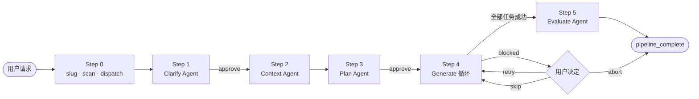
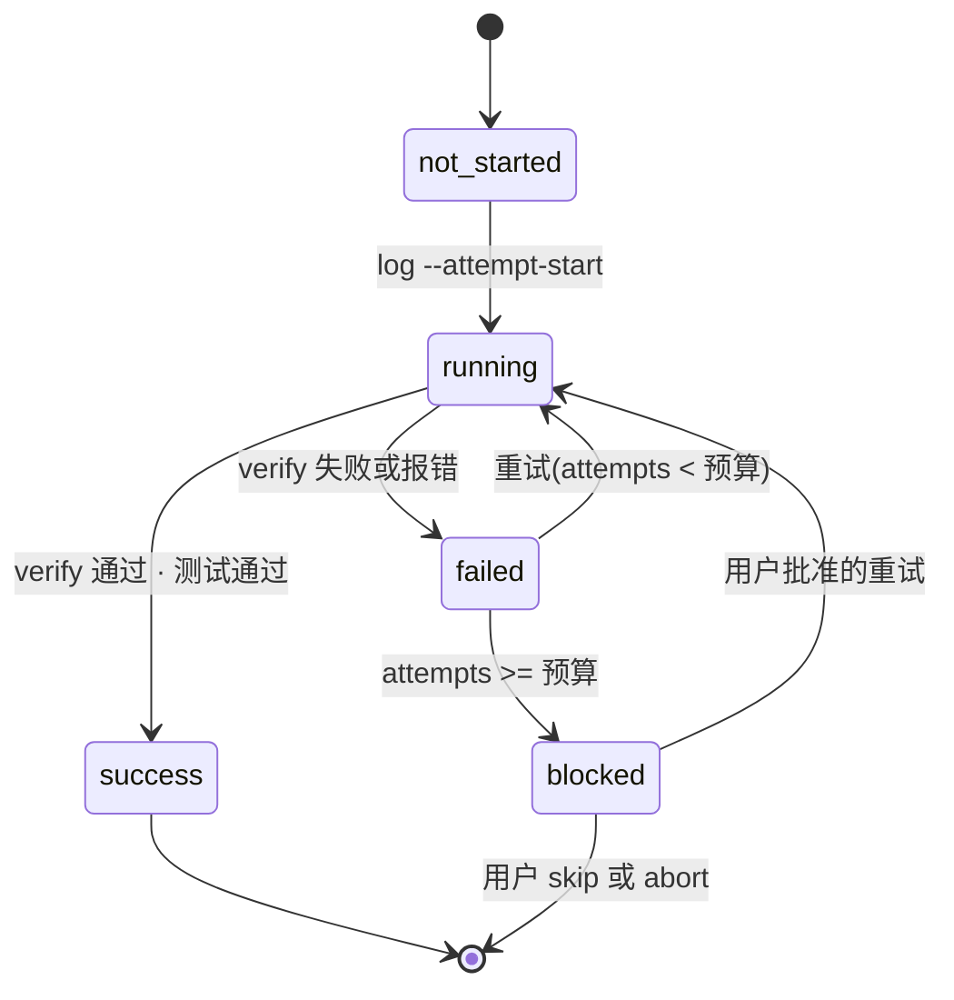

<div align="center">

# harness

**为 Claude Code 打造的自适应 5 阶段功能实现流水线。**

Clarify → Context → Plan → Generate → Evaluate。
确定性状态,崩溃安全续跑,创意工作与簿记之间的硬边界。

[English](./README.md) · [한국어](./README.ko.md) · **简体中文**

[](https://www.python.org/)
[](https://claude.com/claude-code)
[](./scripts/tests/)
[](./scripts/harness.py)

</div>

---

## 能做什么

一次技能调用,从想法到可审代码的五阶段之旅:

```
/harness 给 Flask 应用加一个 /version 接口
```

- Claude 分析请求,请你确认讨论点
- 走一遍代码库,把自己对齐到项目约定
- 写一份 Phase/Task YAML 计划,请你签字
- 通过专属子代理逐个执行任务,带结构化状态
- 运行它在项目中找到的 type / lint / test 工具,给出结论

任何步骤崩溃,重启后的会话会调用 `harness scan <slug>`,**从下一个可运行任务精确续跑** —— 不重新澄清,不重新规划,不重跑已完成的工作。

## 为什么要做混合技能

大多数 Claude Code 工作流完全活在自然语言里,这把两种截然不同的工作混在一起:

- **创意。** 设计计划、写代码、诊断新的失败、与用户对话。
- **簿记。** 哪个任务跑过了?它真的产出了它声称的文件吗?计划哈希和任务日志是否仍一致?下一个跑什么?

用自然语言做第二种事情既昂贵(Claude 每轮都要重推状态)、又漂移(同一问题,不同会话答案不同)、又脆弱(失败任务在续跑时可能被错标为完成)。

`harness` 用一份硬契约把两条车道分开:

| 车道 | 执行者 | 职责 |
|---|---|---|
| 创意 | Claude(Skill + Agent) | Clarify · Context · Plan · Task 实现 · Evaluate · 用户对话 · 失败推理 |
| 确定性 | `scripts/harness.py` | slug 规范化 · 状态扫描 · 续跑点计算 · sidecar 写入 · 产物校验 · 冲突检测 · summary 汇总 · 闸口审批 · 计划归档 |

CLI 绝不调用 LLM。Skill 绝不碰 sidecar。

## 快速开始

在任意 Claude Code 会话中安装:

```
/plugin marketplace add skarl86/harness
/plugin install harness@claude-harness
```

> `skarl86/harness` 是存放 marketplace 的 GitHub slug。`claude-harness` 是 `.claude-plugin/marketplace.json` 声明的 marketplace 名称。插件本身叫 `harness`。

一次性运行时前置:

```bash
pip install pyyaml
```

然后调用技能:

```
/harness <功能请求>
```

产物写入项目内的 `.harness/{slug}/`,多个并发请求互不覆盖。

> **开发安装**(克隆代替 marketplace —— 适合改 `harness` 本身时):
> ```bash
> git clone https://github.com/skarl86/harness.git ~/.claude/plugins/harness
> pip install pyyaml
> ```

## 架构



在 Step 4 内部,每个任务走一个由 CLI 驱动的小状态机:



## 特性

- **续跑优先。** `scan` 从结构化 task sidecar 与计划 checksum 推导状态,而不是靠文件是否存在的启发式。任意位置崩溃,重启,继续。
- **自适应失败分类。** `classify-failure` 返回 A(自动重试)、B(用户判断)或 C(上报),并附 reasons[] —— 最终由 Claude 拍板。
- **并行安全。** 没有 `depends_on` 的任务可在同一消息中并行;`conflicts` 会在冲突前捕捉重叠的 `artifacts.outputs` 声明。
- **Stale 感知。** 每个任务 sidecar 携带执行时刻的计划 checksum;`stale` 在就地编辑计划后立刻暴露漂移。
- **语言感知 verify。** `verify --syntax` 在恒开的结构校验之上,按扩展名运行 stdlib 解析器(`py_compile`、`json.load`、`yaml.safe_load`)。
- **闸口强制。** Clarify 与 Plan 阶段必须先 `approve --step N` 才能前进。不接受纯自然语言的握手。
- **持久化 config。** `harness config --max-attempts N` 跨 shell 存活,无需环境变量体操。
- **Schema 版本化状态。** 每份持久化 JSON 都携带 `schema_version: 1`。未知版本直接拒绝。
- **原子写入。** 状态文件用 `tempfile + os.replace`。写到一半崩溃只会留下旧文件或空无一物,绝不残留半成品。

## 命令

完整参考:[`scripts/README.md`](./scripts/README.md)。所有命令在 exit=0 时向 stdout 输出 JSON,否则向 stderr 输出人类可读的诊断。

| 命令 | 用途 |
|---|---|
| `slug` | 规范化 slug,创建 `.harness/{slug}/`,写入 `00-request.md` |
| `scan` | 计算完整流水线状态(steps、phases、resume point、orphans、stale) |
| `next` | 返回下一个可运行任务及其完整计划定义 |
| `log` | 原子地创建或更新任务状态 sidecar |
| `verify` | 检查声明的 output 是否存在(可选 `--syntax` 语法检查) |
| `conflicts` | 在并行执行前检测任务间的 output 重叠 |
| `summary` | 把任务状态汇总到 `04-generate/summary.md` |
| `approve` | 记录 step 1(Clarify)或 step 3(Plan)的用户闸口审批 |
| `archive-plan` | 重新规划时,把当前 `03-plan/` 移到 `03-plan.v{N}/` |
| `classify-failure` | 启发式失败分类(A/B/C)并附理由 |
| `stale` | 暴露计划 checksum 与审批 artifact 的漂移 |
| `cleanup` | 备份(默认)或清除(`--purge`)某个 slug 的 artifact 树 |
| `list` | 枚举 `.harness/` 下所有 slug |
| `config` | 查看或更新每个 slug 的 `config.json`(例如 `--max-attempts N`) |

会话片段示例:

```bash
$ harness scan add-login-feature | jq .resume_point
{
  "task_id": "2.2",
  "phase": 2,
  "reason": "failed_within_budget"
}

$ harness classify-failure add-login-feature 2.2 | jq '{suggested_class, confidence, reasons}'
{
  "suggested_class": "A",
  "confidence": "high",
  "reasons": [
    "1/2 outputs with issues: src/auth/login.ts (empty)"
  ]
}
```

## 产物目录结构

```
.harness/{slug}/
├── 00-request.md                用户的原始请求
├── 01-clarify.md                Clarify 代理产物 + 用户反馈
├── 02-context.md                Context 代理产物(代码库约定)
├── 03-plan/
│   ├── phase-1-*.yaml
│   └── phase-2-*.yaml
├── 03-plan.v1/                  历史计划归档(如有)
├── 04-generate/
│   ├── task-1.1.md              供人阅读的报告(自由格式)
│   ├── task-1.1.json            机器状态 sidecar(schema 版本化)
│   ├── task-1.2.md / .json
│   └── summary.md               汇总报告
├── 05-evaluate.md               质量结论
├── .approvals/
│   ├── step-1.json
│   └── step-3.json
└── config.json                  按 slug 覆盖配置(可选)
```

Schema 位于 [`scripts/schemas/`](./scripts/schemas/):

- [`task-state.schema.json`](./scripts/schemas/task-state.schema.json) —— 单任务 sidecar
- [`plan.schema.json`](./scripts/schemas/plan.schema.json) —— phase YAML
- [`approval.schema.json`](./scripts/schemas/approval.schema.json) —— 闸口审批
- [`config.schema.json`](./scripts/schemas/config.schema.json) —— 按 slug 的 config

## 开发

```bash
git clone https://github.com/skarl86/harness.git
cd harness
pip install pyyaml jsonschema   # jsonschema 仅测试用

python3 -m unittest scripts.tests.test_harness
# Ran 79 tests in 0.4s — OK
```

仓库结构:

```
harness/
├── .claude-plugin/
│   └── plugin.json              插件清单
├── skills/harness/
│   └── SKILL.md                 Claude 遵循的工作流
├── scripts/
│   ├── harness.py               CLI(stdlib + PyYAML)
│   ├── README.md                CLI 契约参考
│   ├── schemas/                 JSON Schemas
│   └── tests/                   单元测试 + fixtures
└── dogfood/
    ├── run-1-urldecode/         全新项目,模拟失败
    └── run-2-notes-search/      非空代码库,并行冲突
```

## Dogfood

两次真实的流水线运行已作为技能实际产出的证据提交入库。每个目录包含:

- 生成的代码(`urldecode.py`、`notes.py`、测试)
- 完整的 `.harness/{slug}/` 产物树
- 记录观察到的摩擦与已应用补丁的 `FINDINGS.md`

| 运行 | 场景 | 暴露的摩擦 |
|---|---|---|
| [run-1-urldecode](./dogfood/run-1-urldecode/) | 空项目、全新流水线、带重试的模拟 SyntaxError | F1 环境变量持久化;F2 verify 范围 |
| [run-2-notes-search](./dogfood/run-2-notes-search/) | 已有 `notes.py` + 测试、并行冲突、回归测试 | F5 回归测试指引;F6 同文件冲突保守性 |

四处可修复的摩擦都已在树内解决。

## 发布流程

版本由 [release-please](https://github.com/googleapis/release-please) 管理,由 [Conventional Commits](https://www.conventionalcommits.org/) 驱动。

- 贡献者 PR 使用 commit prefix:`feat:`、`fix:`、`chore:`、`docs:`、`refactor:`、`test:`、`perf:`、`ci:`。正文的 `BREAKING CHANGE:` 触发 major bump。
- 把带 `feat:` 或 `fix:` commit 的 PR 合并到 `main`,release-please 会打开或更新一个 **release PR**。release PR 会升 `plugin.json` 的 `version` 并重写 `CHANGELOG.md`。
- 合并 release PR 会创建 `vX.Y.Z` tag 和附带自动生成 notes 的 GitHub Release。
- 在 tag push 时,第二个 workflow 会把 `marketplace.json` 里插件的 `source` 重写并钉到已发布的 commit sha。此后 `/plugin update harness` 的用户会拿到精确发布的 artifact,而不是当时 `main` 上的任何版本。

`ci.yml` 在每个 PR 与每次向 `main` 推送时运行完整单元测试矩阵(Python 3.9–3.12)、JSON Schema 合规、manifest 健全性,以及端到端 CLI 冒烟测试。

## 状态

早期但可用。CLI 表面完整(13/13 子命令),三次 dogfood 运行抵达 `pipeline_complete`,状态管理层无已知正确性 bug。

已知后续事项在 [GitHub Issues](https://github.com/skarl86/harness/issues) 跟踪。

## 致谢

为 [Claude Code](https://claude.com/claude-code) 打造。插件布局约定(`.claude-plugin/plugin.json`、`${CLAUDE_PLUGIN_ROOT}` 替换)借鉴自 Claude Code 插件 marketplace 的模式。
