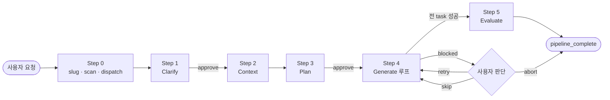
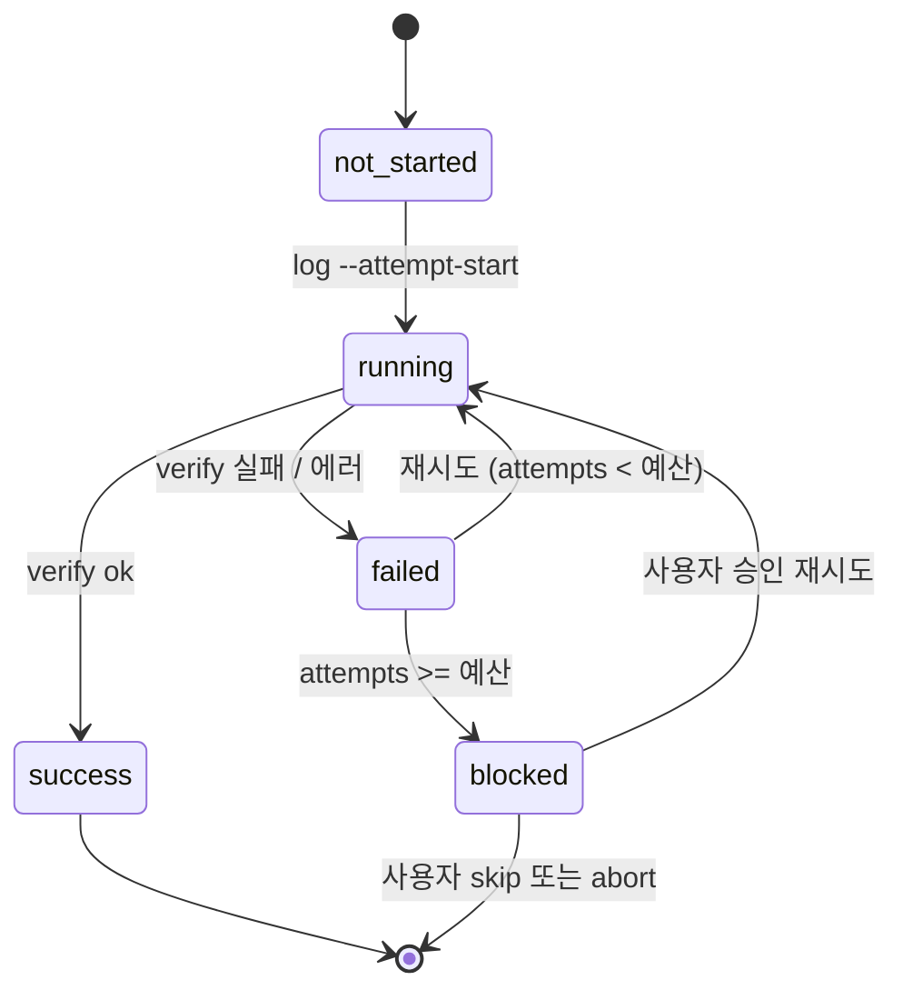

<div align="center">

# Harness Skill

**Claude Code를 위한 5단계 재개 안전 기능 구현 스킬.**

`Clarify` → `Context` → `Plan` → `Generate` → `Evaluate`

[English](./README.md) · **한국어** · [简体中文](./README.zh.md)

[](https://claude.com/claude-code)
[](https://www.python.org/)
[](../../scripts/tests/)
[](../../scripts/harness.py)

</div>

---

## 개요

`harness`는 하나의 기능 요청을 다섯 단계 파이프라인으로 구조화해 실행하는 Claude Code 스킬이다. 각 단계는 자기만의 프롬프트와 산출물을 가진 전용 서브 에이전트이며, 각 게이트는 Claude가 다음으로 넘어가기 전에 **결정적 체크**를 통과해야 한다.

```text
/harness Flask 앱에 /version 엔드포인트 추가
```

- 사용자가 **진짜로 원하는 것**을 먼저 명확히 한다
- 코드베이스를 훑어 프로젝트 컨벤션에 자기를 정렬한다
- 사용자가 서명할 수 있는 Phase/Task YAML 계획을 만든다
- 계획을 task 단위로 실행하며, task마다 상태를 남긴다
- 프로젝트의 자체 도구로 결과를 검증하고 판정을 낸다

어디서 죽든 다음 세션은 **정확히 멈춘 자리에서 재개**한다 — 재명확화·재계획·완료 작업 재실행 없이.

---

## 5단계

| # | 단계 | 서브 에이전트 | 산출물 |
|---|---|---|---|
| 1 | **Clarify** | `general-purpose` | `01-clarify.md` + 사용자 피드백 섹션 |
| 2 | **Context** | `Explore` | `02-context.md` (스택, 컨벤션, 관련 파일) |
| 3 | **Plan** | `Plan` | `03-plan/phase-N-*.yaml` (phase + task + 의존성) |
| 4 | **Generate** | `general-purpose` (task별) | `04-generate/task-*.md` + `.json` 사이드카 |
| 5 | **Evaluate** | `general-purpose` | `05-evaluate.md` (타입·린트·빌드·테스트 판정) |

**1단계**와 **3단계**는 **하드 게이트**다 — `approve --step N` 없이 스킬은 다음으로 넘어가지 않는다.

---

## 빠른 시작

Claude Code 세션 안에서 1회 설치:

```text
/plugin marketplace add skarl86/harness
/plugin install harness@claude-harness
```

런타임 사전 요건:

```bash
pip install pyyaml
```

스킬 호출:

```text
/harness <기능 요청>
```

산출물은 프로젝트 내 `.harness/{slug}/` 밑에 쓰이므로, 동시 요청이 서로를 덮어쓰지 않는다.

---

## 두 레인 모델

대부분의 Claude Code 워크플로는 모든 일을 자연어로 한다. `harness`는 작업을 단단한 경계로 쪼갠다:

| 레인 | 담당 | 책임 |
|---|---|---|
| **창의** | Claude (Skill + 서브 에이전트) | 요구사항 분석 · 코드베이스 해석 · 계획 설계 · 코드 생성 · 실패 원인 진단 · 사용자 대화 |
| **결정적** | `scripts/harness.py` | 슬러그 정규화 · 상태 스캔 · 재개 지점 계산 · 사이드카 쓰기 · 산출물 검증 · 충돌 감지 · 승인 게이트 · 계획 아카이브 |

CLI는 절대 LLM을 호출하지 않는다. 스킬은 절대 task 사이드카를 손으로 고치지 않는다.

---

## 파이프라인 흐름



Step 4 안에서 각 task는 CLI가 주관하는 작은 상태 머신을 따른다:



---

## 산출물 레이아웃

```text
.harness/{slug}/
├── 00-request.md              원본 사용자 요청
├── 01-clarify.md              Clarify 결과 + 사용자 피드백
├── 02-context.md              코드베이스 컨벤션·스택·관련 파일
├── 03-plan/
│   ├── phase-1-*.yaml
│   └── phase-2-*.yaml
├── 03-plan.v1/                이전 계획 아카이브 (있으면)
├── 04-generate/
│   ├── task-1.1.md            사람용 리포트
│   ├── task-1.1.json          기계용 사이드카 (스키마 버전 고정)
│   └── summary.md             집계 리포트
├── 05-evaluate.md             품질 판정
├── .approvals/
│   ├── step-1.json
│   └── step-3.json
└── config.json                슬러그별 override (선택)
```

---

## 안전한 재개

모든 호출의 진입점은 `harness scan <slug>`다. 구조화된 사이드카와 계획 체크섬으로부터 현재 파이프라인 상태를 계산해 — 파일 존재 여부 휴리스틱이 아니다 — `resume_point.reason`을 반환한다:

- `pipeline_complete` — 이미 완료
- `steps_incomplete` — 해당 Step으로 점프
- `waiting_for_approval` — artifact 재표시 후 피드백 수집·승인
- `failed_within_budget` / `in_progress` — Generate 루프 계속
- `blocked` — 차단된 task를 사용자에게 보고

어디서 죽든, 재시작, 계속.

---

## 핵심 특징

- **재개 우선.** 구조화된 사이드카와 계획 체크섬으로 상태를 도출. 파일 휴리스틱 금지.
- **적응적 실패 분류.** `classify-failure`가 A(자동 재시도) / B(사용자 판단) / C(에스컬레이션)을 근거와 함께 제안. 최종 결정은 Claude.
- **병렬 안전.** `conflicts`가 병렬 후보 task들의 output 중복을 사전 감지.
- **Stale 감지.** 각 사이드카는 실행 시점 계획 체크섬을 보관. 계획이 바뀌면 즉시 드러난다.
- **게이트 강제.** Clarify / Plan 단계는 `approve --step N` 기록 없이 통과 불가.
- **원자적 쓰기.** `tempfile + os.replace` — 중간 크래시가 부분 상태를 남기지 않는다.
- **스키마 버전 고정.** 모든 영속 JSON에 `schema_version: 1`.

---

## 관련 문서

- **[SKILL.md](./SKILL.md)** — `/harness` 호출 시 Claude가 따르는 전체 워크플로
- **[scripts/README.md](../../scripts/README.md)** — CLI 서브커맨드 계약
- **[루트 README](../../README.md)** — 플러그인 수준 개요·아키텍처·릴리스 프로세스
- **[Dogfood 런](../../dogfood/)** — 실제 파이프라인 실행 기록

---

<div align="center">

[Claude Code](https://claude.com/claude-code)를 위해 만들었습니다.

</div>
