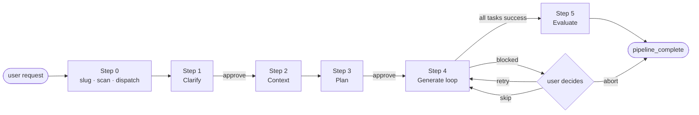
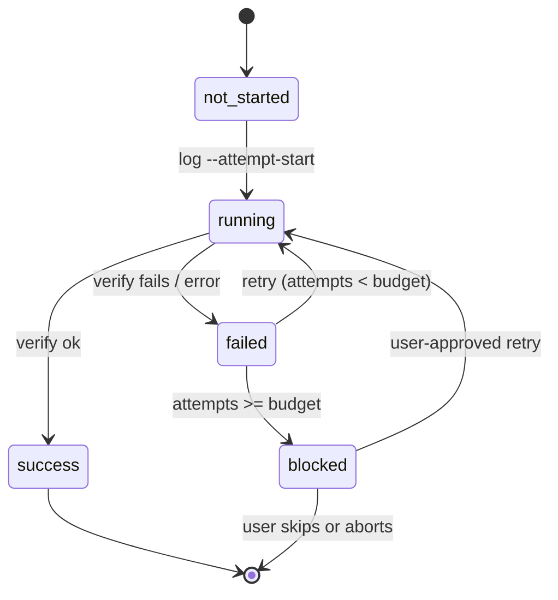

<div align="center">

# Harness Skill

**A 5-phase, resume-safe feature-implementation skill for Claude Code.**

`Clarify` → `Context` → `Plan` → `Generate` → `Evaluate`

**English** · [한국어](./README.ko.md) · [简体中文](./README.zh.md)

[](https://claude.com/claude-code)
[](https://www.python.org/)
[](../../scripts/tests/)
[](../../scripts/harness.py)

</div>

---

## Overview

`harness` is a Claude Code skill that turns a single feature request into a structured, five-phase pipeline. Each phase is a dedicated sub-agent with its own prompt and artifact; each gate has a deterministic check before Claude proceeds.

```text
/harness Add a /version endpoint to the Flask app
```

- Clarifies what you actually want
- Grounds itself in your codebase
- Produces a Phase/Task YAML plan you sign off on
- Executes the plan task-by-task, with per-task state
- Verifies the result with your project's own tooling

If anything crashes, the next session resumes **exactly where it stopped** — no re-clarifying, no re-planning, no re-doing finished work.

---

## The five phases

| # | Phase | Sub-agent | Artifact |
|---|---|---|---|
| 1 | **Clarify** | `general-purpose` | `01-clarify.md` + user-feedback section |
| 2 | **Context** | `Explore` | `02-context.md` (stack, conventions, related files) |
| 3 | **Plan** | `Plan` | `03-plan/phase-N-*.yaml` (phases + tasks + deps) |
| 4 | **Generate** | `general-purpose` (per task) | `04-generate/task-*.md` + `.json` sidecars |
| 5 | **Evaluate** | `general-purpose` | `05-evaluate.md` (type · lint · build · test verdict) |

Phases **1** and **3** are **hard gates** — the skill blocks on `approve --step N` before moving on.

---

## Quick start

One-time install (from any Claude Code session):

```text
/plugin marketplace add skarl86/harness
/plugin install harness@claude-harness
```

Runtime prerequisite:

```bash
pip install pyyaml
```

Invoke the skill:

```text
/harness <your feature request>
```

Artifacts are written to `.harness/{slug}/` in your project, so concurrent requests don't collide.

---

## The two-lane model

Most Claude Code workflows try to do everything in prose. `harness` splits the work along a hard seam:

| Lane | Owner | Responsibilities |
|---|---|---|
| **Creative** | Claude (Skill + sub-agents) | Requirements analysis · codebase reading · plan design · code generation · failure diagnosis · user dialogue |
| **Deterministic** | `scripts/harness.py` | Slug canonicalization · state scan · resume-point computation · sidecar writes · output verification · conflict detection · approval gates · plan archival |

The CLI never calls an LLM. The skill never edits a task sidecar by hand.

---

## Pipeline flow



Inside Step 4, each task rides a small state machine driven by the CLI:



---

## Artifact layout

```text
.harness/{slug}/
├── 00-request.md              user's raw request
├── 01-clarify.md              Clarify Agent output + user feedback
├── 02-context.md              codebase conventions, stack, related files
├── 03-plan/
│   ├── phase-1-*.yaml
│   └── phase-2-*.yaml
├── 03-plan.v1/                archived prior plan (if any)
├── 04-generate/
│   ├── task-1.1.md            human-readable report
│   ├── task-1.1.json          machine sidecar (schema-versioned)
│   └── summary.md             rolled-up report
├── 05-evaluate.md             quality verdict
├── .approvals/
│   ├── step-1.json
│   └── step-3.json
└── config.json                per-slug overrides (optional)
```

---

## Resume, safely

The entry point for every invocation is `harness scan <slug>`. It derives the current pipeline state from structured sidecars and plan checksums — not from file-existence heuristics — and returns a `resume_point.reason`:

- `pipeline_complete` — already done
- `steps_incomplete` — jump to the named step
- `waiting_for_approval` — reshow the artifact, capture feedback, approve
- `failed_within_budget` / `in_progress` — continue the Generate loop
- `blocked` — surface the blocked tasks to the user

Crash anywhere, restart, keep going.

---

## Highlights

- **Resume-first.** Structured sidecars + plan checksums, not file heuristics.
- **Adaptive failure classification.** `classify-failure` returns class A (auto-retry), B (user), or C (escalate) with reasons; Claude makes the final call.
- **Parallel-safe.** `conflicts` catches overlapping output declarations before they clash.
- **Stale-aware.** Each sidecar carries the plan-at-execution-time checksum.
- **Gate-enforced.** Clarify and Plan phases require `approve --step N` to advance.
- **Atomic writes.** `tempfile + os.replace` — crash mid-write never leaves partial state.
- **Schema-versioned.** Every persisted JSON carries `schema_version: 1`.

---

## Related

- **[SKILL.md](./SKILL.md)** — the full workflow Claude follows when `/harness` is invoked
- **[scripts/README.md](../../scripts/README.md)** — CLI subcommand contracts
- **[Root README](../../README.md)** — plugin-level overview, architecture, release process
- **[Dogfood runs](../../dogfood/)** — real pipeline traces committed as evidence

---

<div align="center">

Built for [Claude Code](https://claude.com/claude-code).

</div>
