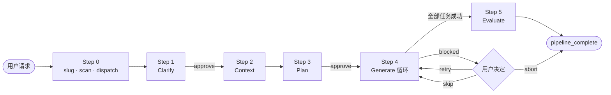
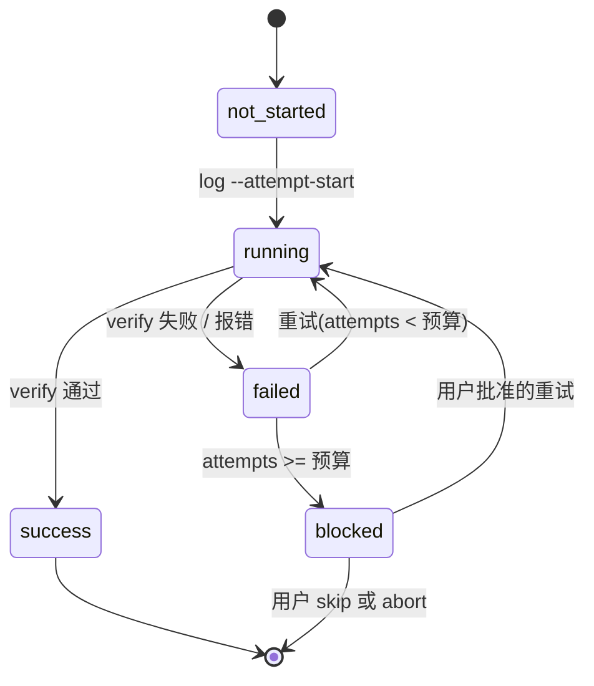

<div align="center">

# Harness Skill

**为 Claude Code 打造的 5 阶段、可断点续跑的功能实现技能。**

`Clarify` → `Context` → `Plan` → `Generate` → `Evaluate`

[English](./README.md) · [한국어](./README.ko.md) · **简体中文**

[](https://claude.com/claude-code)
[](https://www.python.org/)
[](../../scripts/tests/)
[](../../scripts/harness.py)

</div>

---

## 概览

`harness` 是一个 Claude Code 技能,它把一次功能请求拆成**五阶段流水线**来执行。每个阶段都是带有专属提示词和产物的子代理;每道闸口都有**确定性校验**,通过后 Claude 才会进入下一步。

```text
/harness 给 Flask 应用加一个 /version 接口
```

- 先把你**真正想要的**搞清楚
- 读一遍代码库,把自己对齐到项目约定
- 产出一份你可以签字的 Phase/Task YAML 计划
- 按 task 逐个执行,每个 task 都留下状态
- 用项目自带的工具链验证产物并给出结论

不管中途在哪里崩了,下一次会话都能**从停下的那一刻精确续跑** —— 不重新澄清,不重新规划,不重跑已完成的工作。

---

## 五阶段

| # | 阶段 | 子代理 | 产物 |
|---|---|---|---|
| 1 | **Clarify** | `general-purpose` | `01-clarify.md` + 用户反馈段 |
| 2 | **Context** | `Explore` | `02-context.md`(技术栈、约定、相关文件) |
| 3 | **Plan** | `Plan` | `03-plan/phase-N-*.yaml`(阶段 + 任务 + 依赖) |
| 4 | **Generate** | `general-purpose`(每个 task) | `04-generate/task-*.md` + `.json` sidecar |
| 5 | **Evaluate** | `general-purpose` | `05-evaluate.md`(类型 · lint · 构建 · 测试 结论) |

**阶段 1** 与 **阶段 3** 是**硬闸口** —— 没有 `approve --step N` 记录,技能不会前进。

---

## 快速开始

在任意 Claude Code 会话中一次性安装:

```text
/plugin marketplace add skarl86/harness
/plugin install harness@claude-harness
```

运行时前置:

```bash
pip install pyyaml
```

调用技能:

```text
/harness <功能请求>
```

产物都写到项目内的 `.harness/{slug}/` 下,多个并发请求互不覆盖。

---

## 双车道模型

大多数 Claude Code 工作流把所有事情都堆在自然语言里。`harness` 在中间划了一条硬边:

| 车道 | 执行者 | 职责 |
|---|---|---|
| **创意** | Claude(Skill + 子代理) | 需求分析 · 代码库阅读 · 计划设计 · 代码生成 · 失败归因 · 与用户对话 |
| **确定性** | `scripts/harness.py` | slug 规范化 · 状态扫描 · 续跑点计算 · sidecar 写入 · 产物校验 · 冲突检测 · 审批闸口 · 计划归档 |

CLI 绝不调用 LLM。技能绝不手动编辑 task sidecar。

---

## 流水线流程



在 Step 4 内部,每个 task 走一个由 CLI 驱动的小状态机:



---

## 产物目录结构

```text
.harness/{slug}/
├── 00-request.md              用户的原始请求
├── 01-clarify.md              Clarify 代理产物 + 用户反馈
├── 02-context.md              代码库约定、技术栈、相关文件
├── 03-plan/
│   ├── phase-1-*.yaml
│   └── phase-2-*.yaml
├── 03-plan.v1/                历史计划归档(如有)
├── 04-generate/
│   ├── task-1.1.md            供人阅读的报告
│   ├── task-1.1.json          机器 sidecar(带 schema 版本)
│   └── summary.md             汇总报告
├── 05-evaluate.md             质量结论
├── .approvals/
│   ├── step-1.json
│   └── step-3.json
└── config.json                按 slug 覆盖配置(可选)
```

---

## 安全续跑

每次调用的入口都是 `harness scan <slug>`。它从结构化的 sidecar 和计划 checksum 推导当前流水线状态 —— 不是靠猜文件是否存在 —— 并返回 `resume_point.reason`:

- `pipeline_complete` — 已完成
- `steps_incomplete` — 跳到指定 step
- `waiting_for_approval` — 重新展示产物、收集反馈、审批
- `failed_within_budget` / `in_progress` — 继续 Generate 循环
- `blocked` — 把受阻的 task 交给用户

任意位置崩溃,重启,继续前进。

---

## 关键特性

- **续跑优先。** 从结构化 sidecar + 计划 checksum 推导状态,不用文件存在性启发式。
- **自适应失败分类。** `classify-failure` 会给出 A(自动重试)/ B(用户判断)/ C(上报)并附带原因。最终判断权在 Claude。
- **并行安全。** `conflicts` 会在并行候选 task 之间事先检测输出重叠。
- **Stale 感知。** 每个 sidecar 都带执行时刻的计划 checksum,计划一改立即暴露。
- **闸口强制。** Clarify / Plan 没有 `approve --step N` 记录就过不去。
- **原子写入。** `tempfile + os.replace` —— 写到一半崩溃也不会留下半成品状态。
- **Schema 版本化。** 每份持久化 JSON 都携带 `schema_version: 1`。

---

## 相关文档

- **[SKILL.md](./SKILL.md)** —— `/harness` 被调用时 Claude 遵循的完整工作流
- **[scripts/README.md](../../scripts/README.md)** —— CLI 子命令契约
- **[根目录 README](../../README.md)** —— 插件级别概览、架构、发布流程
- **[Dogfood 运行记录](../../dogfood/)** —— 真实流水线留痕

---

<div align="center">

为 [Claude Code](https://claude.com/claude-code) 打造。

</div>
